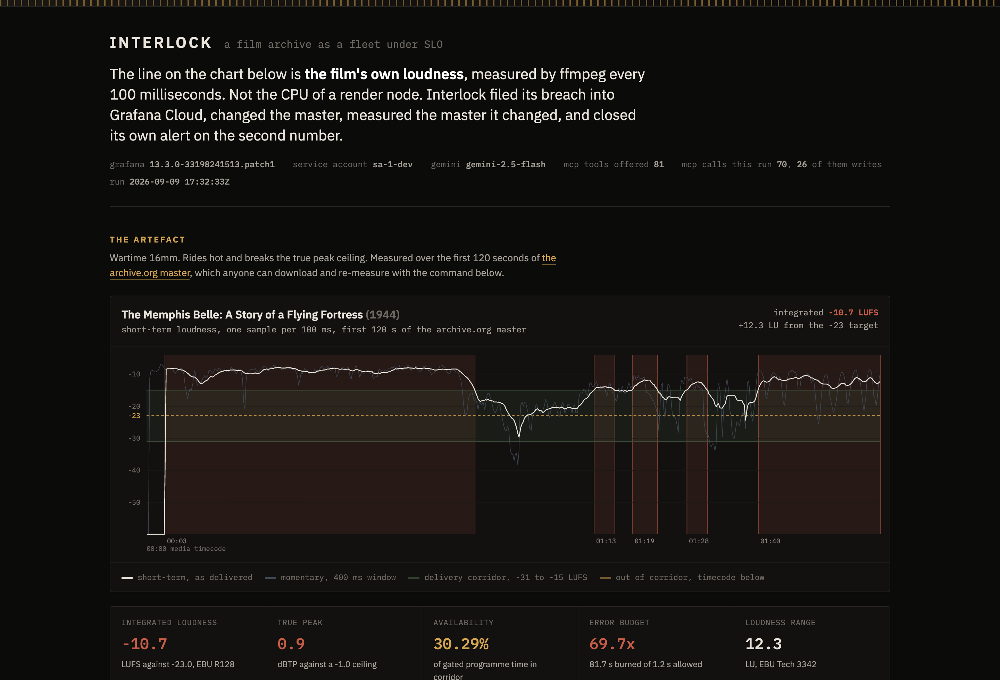
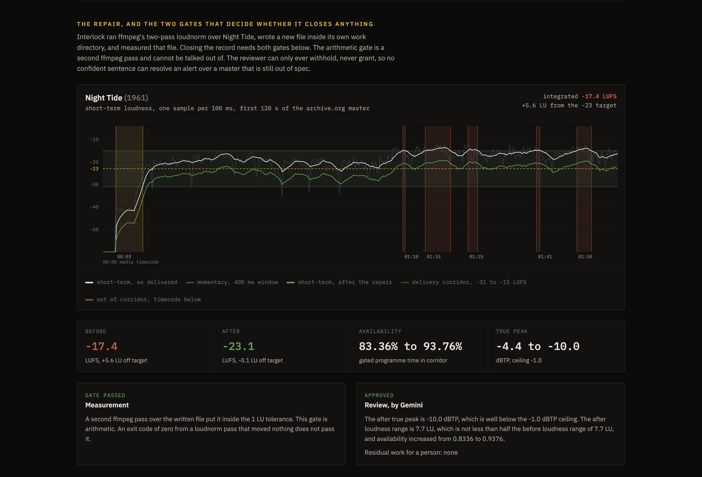
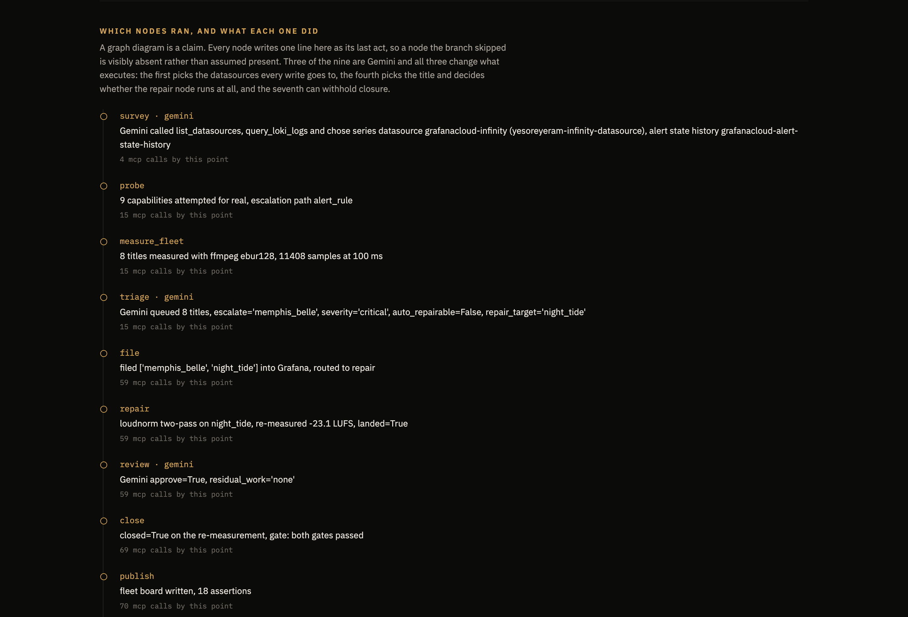
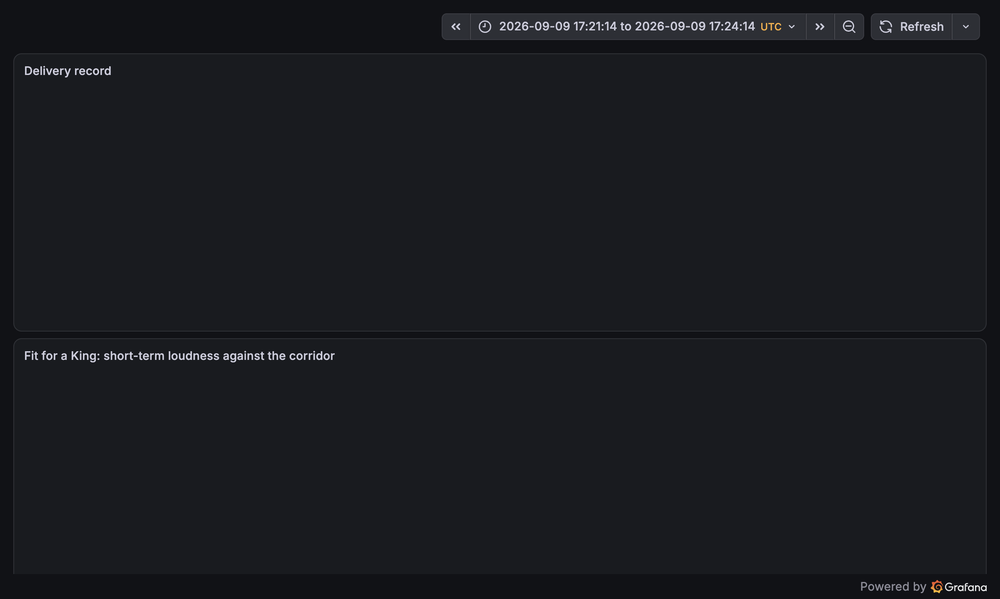
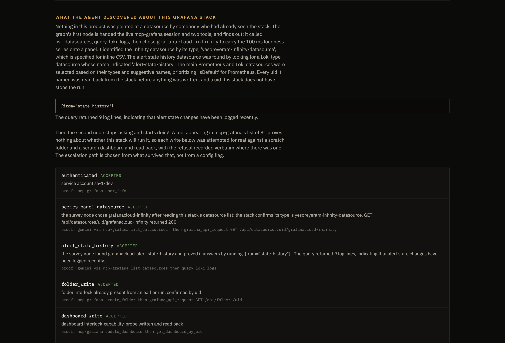
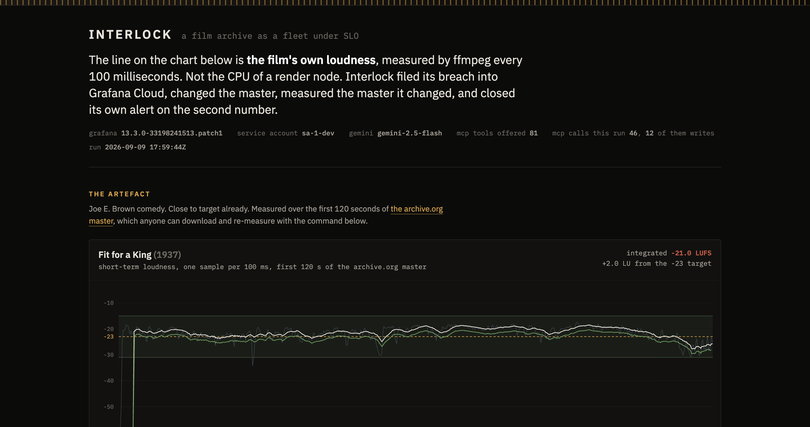
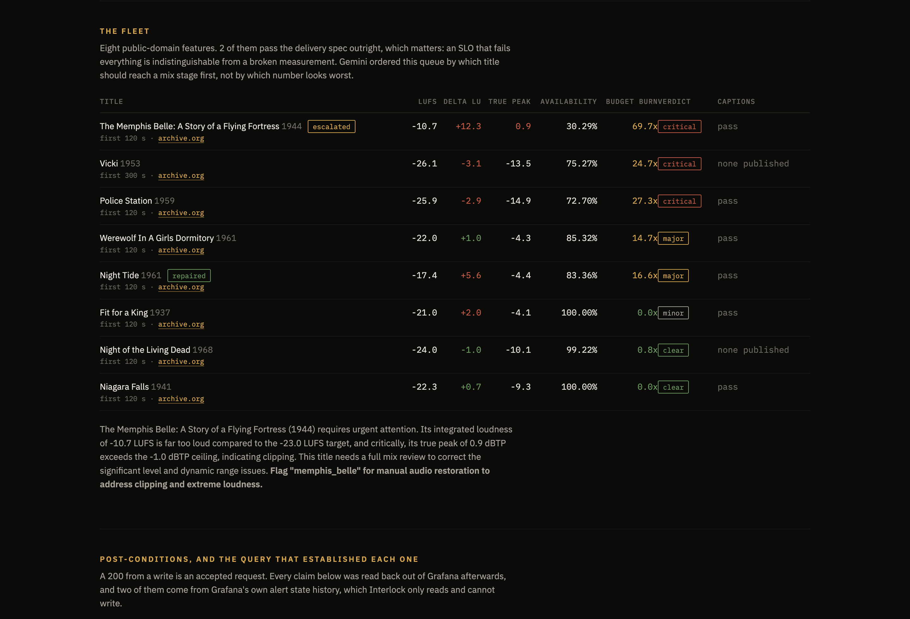
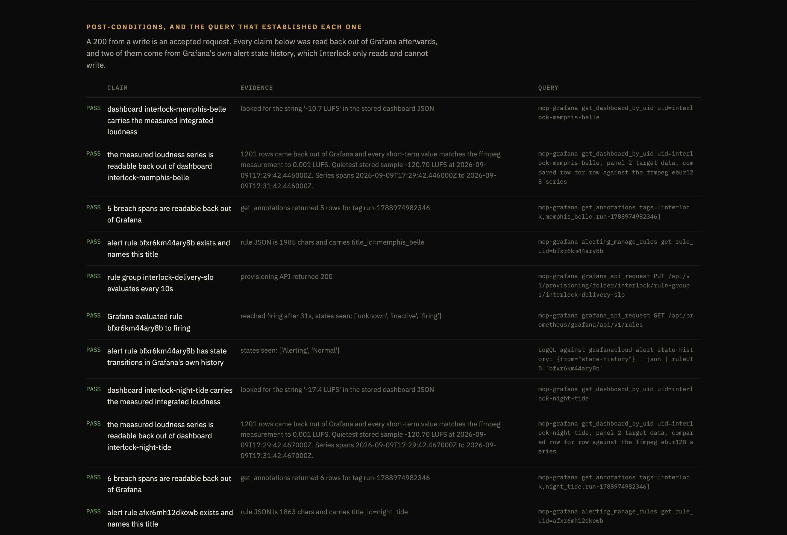

# Interlock

## Elevator pitch

> Interlock measures a film archive against a delivery spec with ffmpeg, files the breach in Grafana Cloud, repairs the master, and closes its own alert only on the second measurement.

182 characters.

## Inspiration

A restoration house delivers a title to a streamer, and a machine on the other end
rejects it. The slip that comes back says the audio failed loudness. It does not say
where. Somebody then sits with the whole feature and a meter, finds the reel that runs
quiet, fixes it, and re-delivers, and the queue behind them does not move while they do.

The measurement that would have told them where is not hard. `ffmpeg -af ebur128` prints
a loudness reading every 100 milliseconds, and has for years. Point it at Vicki (1953)
off archive.org and it says the first 300 seconds sit at -26.1 LUFS against a -23 target:

```bash
curl -L -r 0-24000000 -o vicki.mp4 \
  "https://archive.org/download/vicki-1953/Vicki%20%281953%29.mp4"
ffmpeg -hide_banner -i vicki.mp4 -t 300 -af ebur128=peak=true -f null -
# Integrated loudness:  I: -26.1 LUFS
```

So the numbers exist. Interlock treats them the way an SRE team treats a service: a
film archive is a fleet, every title is a service, the delivery spec is its objective,
and every second of programme audio outside the loudness corridor burns error budget.

## What it does

Interlock takes eight public-domain features, measures each one with ffmpeg, and files
the failures into Grafana Cloud through the official `grafana/mcp-grafana` MCP server.
Then it does the thing an observability agent normally stops short of: it repairs a
master, measures the file it wrote, and resolves its own alert on that second number.

Two things about that are unusual.

**The series on the Grafana panel is the film's own loudness.** Not the CPU of a render
node, not a job queue depth. One sample every 100 milliseconds, straight out of ffmpeg's
`ebur128` filter, over films anyone can download and re-measure.



**The alert is closed by a second measurement, not by the repair exiting zero.** The
repair runs a two-pass `loudnorm`, writes a new file, and a third ffmpeg pass measures
that file. `RepairResult.landed` is arithmetic over the number that pass returned. A
`loudnorm` run that exits zero and moves nothing arrives with `landed` false and the
alert stays open.



## One run

```
START -> survey -> probe -> measure_fleet -> triage -> file -> repair -> review -> close -> publish
                                                        |                                    ^
                                                        +---- hold --------------------------+
```

Nine nodes in a `google.adk.workflow.Workflow`, six functions and three `LlmAgent`s, one
branch taken on a structured boolean so the shape of the run is reproducible while the
judgement inside it is not.

| node | what it does |
|---|---|
| `survey` | Gemini, holding an ADK `McpToolset` over mcp-grafana, discovers the stack's datasources and picks the ones this run writes to |
| `probe` | Attempts every Grafana write for real against a scratch folder and dashboard, and records the refusals verbatim |
| `measure_fleet` | ffmpeg `ebur128` over each title, 100 ms momentary and 3 s short-term, plus caption checks |
| `triage` | Gemini ranks the fleet, picks the title to escalate, decides whether one gain change delivers it |
| `file` | Folder, dashboard, one annotation per breach span at its timecode, alert rule create |
| `repair` | Two-pass `loudnorm`, then a third pass that measures the file it wrote |
| `review` | Gemini, which can withhold closure and cannot grant it |
| `close` | Writes the re-measured figure into the alert rule and waits for Grafana to clear it |
| `publish` | The fleet board and the run record the web surface renders |

Every node writes one line into the run record as its last act, so the trace on screen is
what executed rather than what the diagram promises. Here is a full eight-title run:

```
mcp calls       70
nodes executed  survey[llm] -> probe -> measure_fleet -> triage[llm] -> file
                -> repair -> review[llm] -> close -> publish
  survey        Gemini called list_datasources, query_loki_logs and chose series
                datasource grafanacloud-infinity, alert state history
                grafanacloud-alert-state-history
  probe         9 capabilities attempted for real, escalation path alert_rule
  measure_fleet 8 titles measured with ffmpeg ebur128, 11408 samples at 100 ms
  triage        Gemini queued 8 titles, escalate='memphis_belle', severity='critical',
                auto_repairable=False, repair_target='night_tide'
  file          filed ['memphis_belle', 'night_tide'] into Grafana, routed to repair
  repair        loudnorm two-pass on night_tide, re-measured -23.1 LUFS, landed=True
  review        Gemini approve=True, residual_work='none'
  close         closed=True on the re-measurement, gate: both gates passed
  publish       fleet board written, 18 assertions
post-conditions 18 of 18 hold
```

Read the triage line closely, because it is the model earning its place. The Memphis
Belle is the worst title in the fleet and Gemini escalated it, then refused to
auto-repair it, because its true peak is already over the ceiling and a gain change would
clip. It nominated a different title for the repair, and the branch took `repair` on that
one instead.



## Scope

Each title is measured over a stated window, printed beside every figure, because eight
features at full length is minutes of ffmpeg per pass. The repair corrects a level
offset; out-of-corridor spans caused by a dead reel or a blown optical track survive it,
which is why they are filed as annotations at their timecodes for a person.

Two of the eight titles pass the spec outright, and that matters more than the six that
fail. An SLO that condemns every title is indistinguishable from a broken measurement.

| title | window | integrated | true peak | availability | verdict |
|---|---|---|---|---|---|
| The Memphis Belle (1944) | 120 s | -10.7 LUFS | **+0.9 dBTP** | 30.29% | critical |
| Police Station (1959) | 120 s | -25.9 LUFS | -14.9 dBTP | 72.70% | critical |
| Vicki (1953) | 300 s | -26.1 LUFS | -13.5 dBTP | 75.27% | critical |
| Werewolf In A Girls Dormitory (1961) | 120 s | -22.0 LUFS | -4.3 dBTP | 85.32% | major |
| Night Tide (1961) | 120 s | -17.4 LUFS | -4.4 dBTP | 83.36% | major |
| Fit for a King (1937) | 120 s | -21.0 LUFS | -4.1 dBTP | 100.00% | minor |
| Niagara Falls (1941) | 120 s | -22.3 LUFS | -9.3 dBTP | 100.00% | **clear** |
| Night of the Living Dead (1968) | 120 s | -24.0 LUFS | -10.1 dBTP | 99.20% | **clear** |

## What it refuses to guess

A criterion that could not be measured is never a pass. If ffmpeg returns no true peak
block, the ceiling was not checked, so the title reads NOT MEASURED with the reason
rather than in spec. The same holds for a window that sits entirely below the -70 LUFS
absolute gate, where the availability arithmetic would otherwise return a reassuring
100% over programme audio that is not there. A record cannot close on a check that could
not fail.

The repair writes audio only, so caption findings travel from the master's own sidecar
rather than being re-measured on the repaired file, where they would come back clean
because there is nothing to measure.

## How we built it

**Grafana, through the partner's own MCP server.** Interlock holds no Grafana HTTP
client. Every call is a tool call on `grafana/mcp-grafana`, held as a child process over
stdio. Five write classes land per run: `create_folder`, `update_dashboard`,
`create_annotation` once per breach span at its media timecode, `alerting_manage_rules`
create, then the same rule updated with the re-measured figure. Reads that prove them:
`get_dashboard_by_uid`, `get_annotations` by a tag minted by this run,
`grafana_api_request GET /api/prometheus/grafana/api/v1/rules` polled until the ruler
settles, and `query_loki_logs` against `grafanacloud-alert-state-history`.

Nothing reports success from a 200. An accepted `alerting_manage_rules` create means
Grafana received a JSON document, so the run polls the ruler until the rule reaches
`firing`, and after the repair polls it again until `inactive`. The strongest assertion
in the product is the one Interlock cannot write: Grafana logs its own alert state
transitions into a Loki stream that Interlock only ever reads.

```
PASS  Grafana evaluated rule cfxr32fygp2bkc to firing
      reached firing after 52s, states seen: ['unknown', 'inactive', 'firing']
PASS  Grafana evaluated rule afxr359kjzw1sa to inactive
      reached inactive after 16s, states seen: ['firing', 'inactive']
PASS  alert rule afxr359kjzw1sa has state transitions in Grafana's own history
      states seen: ['Alerting', 'Normal']
      LogQL: {from="state-history"} | json | ruleUID=`afxr359kjzw1sa`
```



**The agent drives the toolset, not a query string.** The first node is an `LlmAgent`
holding `google.adk.tools.mcp_tool.McpToolset` over that same server. ADK connects, reads
the tool list off the server, and hands Gemini each tool with mcp-grafana's own JSON
schema, so the model picks the call and shapes the arguments. On this stack it called
`list_datasources` and `query_loki_logs`, chose `grafanacloud-infinity` to carry the 100
ms series and `grafanacloud-alert-state-history` to prove a rule fired.

That answer is load-bearing rather than decorative. Every uid it names is read back from
Grafana before anything is written, and one that does not resolve stops the run, because
a dashboard saved against an invented datasource uid renders an empty panel and Grafana
accepts that write happily. The agent chooses, Grafana adjudicates, neither is trusted
alone.

`tool_filter` is an allowlist of that server's 21 read tools. mcp-grafana offers 81 here
and 20 of them mutate the stack, including `update_dashboard`. A model sent to describe
the stack must not be able to overwrite the delivery record while it looks around.



**Google ADK and Gemini, with the numbers kept deterministic.** The graph is a
`Workflow` with a routing map on `file`, so the same fleet takes the same path twice.
Three nodes are `LlmAgent`s with Pydantic `output_schema`s, and each one changes what
executes: `survey` picks the datasources, `triage` picks the title and decides whether
`repair` runs at all, `review` can withhold closure. Every number they see came out of
ffmpeg and none of them produce one.

Remove the Gemini credentials and the run stops before ffmpeg starts. `GEMINI_MODEL`
alone is not enough, because with Vertex the SDK also needs a project and a location, and
without them the old failure arrived inside the triage node after the whole fleet had
been measured. Nine tests take one credential away each and assert the refusal happens
before any MCP session opens.

**Deployed on Cloud Run**, with the Grafana token supplied from Secret Manager at runtime
and never in the image. The deployed service runs the whole graph, not just the page it
serves: POSTing two title ids to `/api/run` and polling `/api/status` to a terminal state
executed all nine nodes against live Grafana Cloud and Vertex Gemini in 2 minutes 32
seconds, 46 MCP calls with 13 writes, 10 of 10 post-conditions, the series read back out
of Grafana at 1,203 rows matching ffmpeg to 0.001 LUFS, and the record closed on the
re-measurement.



**Built with:** Python 3.13, ffmpeg (`ebur128`, `loudnorm`), Google ADK
(`google.adk.workflow.Workflow`, `LlmAgent`, `McpToolset`), Gemini 2.5 Flash on Vertex AI,
grafana/mcp-grafana v1.3.0, Grafana Cloud (dashboards, annotations, Grafana-managed
alerting, Loki alert state history, Infinity datasource), Model Context Protocol,
Pydantic, Google Cloud Run, Google Secret Manager, archive.org.

## Challenges we ran into

**A test suite can be green and have touched nothing.** pytest counts a skip as a
non-failure, so a suite whose every Grafana test skipped still prints a number with no
red in it, and the number is what people read. `tests/conftest.py` now runs one rule: if
`GRAFANA_URL` and a token are both set, this run asserted a stack is there, so failing to
reach it is red rather than skipped. Only a bare clone skips, and it prints a banner
naming what it did not prove. Three states, all measured: bare clone 67 passed 11 skipped
exit 0, pointed at a hostname with no stack behind it 67 passed 11 errors exit 1, real
stack 78 passed 0 skipped exit 0. Eleven tests move from
skipped to passing, and the runtime moves with them.

**`get_annotations` answers `{"Payload": [...]}`, not a list.** The live test wrote an
annotation, read it back by its own unique tag, and got zero rows. The write had landed;
the caller expected a bare list and read every successful query as empty. Only a test
that talks to the real endpoint can find that, which is the argument against the mock
Grafana that would have agreed with whatever was sent to it.

**Absence rendering as success, on the number that decides whether a master clips.**
`in_spec` checked the true peak only when a true peak figure existed. Drop `peak=true`
from the filter and ffmpeg stops printing that block, the check is skipped, and the title
comes back in spec against a ceiling nobody measured. Worse, the close gate looked only
at integrated loudness, so a record could close on a repaired file whose peaks the gain
change itself had pushed over the ceiling. Both are now failures with a named reason, and
thirteen tests hold it from both sides.

**`alerting_manage_rules` needs an explicit `org_id`.** Without it, the create is refused
with `org_id is required and must be greater than 0` while dashboards, folders and
annotations all succeed, so a stack looks fully writable and still refuses the one write
that opens an alert. The tool's JSON schema does not list `org_id` under `required`, only
mentioning it in a field description, and `GRAFANA_ORG_ID` in the environment does not
help because mcp-grafana reads that for its own configuration while the alerting handler
reads the argument.

**`ffmpeg -nostats` silently removes the loudness series.** The summary block still
prints, so a measurement looks perfect right up until you ask for the shape of the
programme. Same on ffmpeg 9.0.1 with `ebur128=framelog=verbose`, which prints only the
summary. The per-100 ms lines come from the default log level, so the command passes
neither.

**A new rule group evaluates once a minute.** A run that creates a rule, repairs the file
and updates the rule inside forty seconds never observes the firing state at all: the
ruler just reports the final answer. The group interval is set to ten seconds through the
provisioning API, still over MCP, which is what makes the transition visible inside one
run.

**Cloud Run throttles CPU between requests.** The first background run on the deployed
service sat for eight minutes before its MCP server even started. `--no-cpu-throttling`
fixed it. Separately, Cloud Run answers `/healthz` itself with Google's own 404 page and
never forwards it to the container, while `/nope` reaches the app and gets the app's 404.

**One cold read from archive.org cost the whole fleet.** A fresh container asked for The
Memphis Belle, got `curl exit 22`, and `ensure_fleet` raised on the first failure, so the
other seven masters were never fetched and the product had nothing to measure at all. The
fetch now retries with a widening pause, deletes whatever a broken transfer left behind
rather than measuring it, and scopes a refusal to its own title. `/api/status` reports how many masters are on
disk, so a request that arrives while the 190 MB is still landing is told the fleet is
still landing.

## Accomplishments that we're proud of

The alert that closes itself, and cannot be closed any other way. Two independent gates:
arithmetic over a second ffmpeg pass, and a reviewer that can only withhold. A model with
no way to grant closure cannot talk an out-of-spec master into delivery.

The series read-back. A dashboard save returns 200 whether or not the panel carries any
data, so the run asks Grafana for the dashboard back and compares 1,201 rows against the
ffmpeg measurement to 0.001 LUFS. Altering one sample turns that check red, which is how
we know it is a check.

Every capability discovered by trying it. On this stack `create_incident` is advertised,
its plugin is installed and enabled, and a real create fails inside Grafana's own
database on a foreign key against a missing Org row. Nothing in the tool list says so.
The run routes to a Grafana alert rule instead and prints the refusal verbatim.





## What we learned

An accepted request is not a completed operation, and the gap between them is where
demos live. Every write in this product is followed by a read that only a landed write
could answer, and two of them are polls that wait for a system we do not control to
agree with us.

A check that cannot fail is worse than no check, because it occupies the space where a
real one would go. The version of that lesson we did not expect was that it applies to
the tally at the bottom of a test run as much as to any individual assertion.

## What's next for Interlock

Full-length passes rather than declared windows, which is a scheduling problem rather
than a measurement one. Writing the series into Grafana Cloud Prometheus once an Access
Policy token with `metrics:write` is in place, so a title's loudness can be queried
alongside everything else in the stack. And the second failure class: The Memphis Belle
is over the true peak ceiling, which no gain change fixes, and a limiter pass with its
own before-and-after measurement is the same loop applied to a different defect.

## Links

- Live: https://interlock-yfaenbgx7q-uc.a.run.app
- Source: https://github.com/kamalbuilds/interlock (Apache-2.0)
- Demo video: https://vimeo.com/1225375724
- Reproduce any figure: the ffmpeg command sits beside it, on the page and in `README.md`
- Break every check and watch it go red: `bash scripts/prove.sh`, transcript in `PROOF.md`
